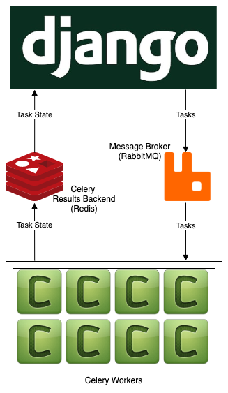

# Architecture



This [demo](https://github.com/oisinBates/celery_progress_demo) was created by [@oisinBates](https://github.com/oisinBates) to orginally showcase the [celery_progress](https://github.com/czue/celery-progress)
package.

# Build

This project requires Python 3.8, and requirements are installed with pip.

## Runtime for Django

You must first run migrations:

```
python3 manage.py migrate
```

Then:

```
python manage.py runserver 0.0.0.0:8000
```

### Environment Variables

1. Generate an API key at [api.nasa.gov](https://api.nasa.gov/) and add it to a `.env` file in the root directory as `NASA_API_KEY` (see [.env.example](/.env.example)).
1. Generate a random value for the SECRET_KEY (django security)

## Runtime for Celery

You can start this up with

```
celery -A demo_project worker -l info --concurrency=8
```
